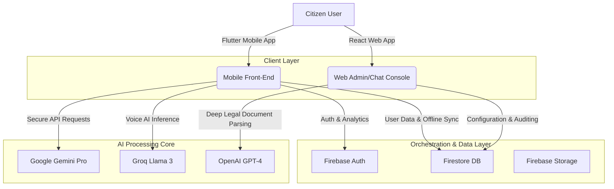

# ROI — The Legal App (Rules of India)

[](https://flutter.dev)
[](https://react.dev)
[](https://firebase.google.com)
[](https://groq.com)
[](LICENSE)

An enterprise-grade, multi-platform legal assistance ecosystem built with **Flutter (Mobile)** and **React (Web)**, designed to democratize legal awareness and empower Indian citizens with constitutional and legal knowledge via advanced Artificial Intelligence.

---

## Table of Contents
- [System Architecture](#system-architecture)
- [Key Features](#key-features)
- [Tech Stack](#tech-stack)
- [Project Directory Structure](#project-directory-structure)
- [Security & Access Configuration](#security--access-configuration)
- [Installation & Setup](#installation--setup)
- [License & Intellectual Property](#license--intellectual-property)

---

## System Architecture



---

## Key Features

### 1. NEEDHi (AI Legal Tutor)
*   A sophisticated, structured AI chatbot designed to explain complex Indian Constitutional laws, criminal codes, and civic rights.
*   **Multilingual Support**: Fully localized legal advice dynamically translated and rendered in multiple languages (Hindi, Tamil, Telugu, Kannada, Bengali, etc.).

### 2. VIDDHI (Voice AI Assistant)
*   A hands-free, high-speed voice assistant that integrates browser/device microphones with real-time speech-to-text and AI legal logic to provide instant verbal legal consultations.

### 3. AI-Driven Daily Quiz
*   An interactive feature that dynamically generates daily legal scenario challenges to test the user's understanding of fundamental rights and constitutional provisions, tracking scores inside Firebase.

### 4. Statute Transformation (IPC vs. BNS)
*   A comprehensive comparative tool mapping sections of the legacy **Indian Penal Code (IPC)** directly to the newly enacted **Bharatiya Nyaya Sanhita (BNS)** to assist users and legal professionals in understanding transitional codes.

---

## Tech Stack

*   **Mobile Framework**: Flutter (Dart) with Bloc/Provider state management
*   **Web Console**: React.js with Tailwind CSS
*   **Backend & DB**: Firebase (Authentication, Firestore Realtime Database, Cloud Storage)
*   **AI Models**: Groq Llama 3, Google Gemini Pro, OpenAI GPT-4 API
*   **Design System**: Curated Plus Jakarta Sans & Inter typography, sleek dark mode aesthetics

---

## Project Directory Structure

```text
ROI-THE-LEGAL-APP/
├── roi_app/                  # Flutter Mobile Application
│   ├── lib/
│   │   ├── consts.dart       # API & Theme configurations
│   │   ├── screens/          # NEEDHi Chat, Quiz, and Legal Info Screens
│   │   └── main.dart         # Entrypoint
│   └── android/app/          # Android Native wrapper
├── legalytics-react/         # React Web Companion Dashboard
│   ├── src/
│   │   ├── components/       # Custom Legal UI Elements
│   │   ├── services/         # API & Groq connection modules
│   │   └── App.js            # Web UI Orchestration
└── README.md                 # Project Documentation
```

---

## Security & Access Configuration

> [!IMPORTANT]
> **API Key Sanitization Notice:** All production API keys (Gemini, OpenAI, Groq, and Firebase credentials) have been removed from the public repository to prevent security risks. 
> To test the interactive AI features, you must configure your local configuration files with valid API tokens as detailed in the setup steps.

---

## Installation & Setup

### Running the Flutter Mobile App
1. Navigate to the mobile application directory:
   ```bash
   cd roi_app
   ```
2. Fetch project dependencies:
   ```bash
   flutter pub get
   ```
3. Add your `google-services.json` (downloaded from your Firebase Console) to the `android/app/` directory.
4. Input your custom API keys into the corresponding config file:
   * Edit `lib/consts.dart` or `lib/screens/ChatbotScreen.dart`
5. Launch the application on a connected device/emulator:
   ```bash
   flutter run
   ```

### Running the React Web Dashboard
1. Navigate to the web project directory:
   ```bash
   cd legalytics-react
   ```
2. Install npm packages:
   ```bash
   npm install
   ```
3. Create a `.env` file in the root of the folder and configure your API endpoint:
   ```env
   REACT_APP_GROQ_API_KEY=your_groq_key_here
   ```
4. Start the development server:
   ```bash
   npm start
   ```

---

## License & Intellectual Property

**Proprietary Portfolio Project** — All rights reserved by **Sriram S**.

This repository is published exclusively for educational review, architectural assessment, and portfolio evaluation. Unauthorized replication, redistribution, commercialization, or modifications of this source code are strictly prohibited without written consent from the author.

*Developed by [Sriram S](https://github.com/SriramGandhiS).*
